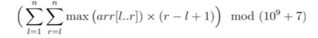

# Queue_Stack_LinkedList
Programs on recursion, queues, stacks, and linked lists.

<h2>Postorder Conversion:</h2>

Conversion of an **inorder** argument to its **postorder** equivalent.

INPUT: In the only line of input, a **mathematical argument** is given.

OUTPUT: In the only line of output, the postorder equivalent is printed.

Sample:

**INPUT:** a+b*(c*d-e)/(f+g*h)-i

**OUTPUT:** abcd*e-fgh*+/*+i-

The solution is achieved by using a **stack**. The main part of the code for the conversion of inorder to postorder is as follows:

```ruby
 if (len(stack) == 0):
  stack.append(char)
elif ( ( (stack[-1] in operator_dict) and (operator_dict[char] > operator_dict[stack[-1]]) ) or stack[-1] == "(" ):
  stack.append(char)
else:
  while ( len(stack) != 0 and ( (stack[-1] in operator_dict) and (operator_dict[char] <= operator_dict[stack[-1]]) ) and stack[-1] != "("):
    output.append(stack.pop())
```

<h2>Wierd Summation:</h2>

A weird mathematical summation problem needs to be solved using elements in an array in a **limited time**.

The argument is given as below:



INPUT: In the first line n is given, which is the **number of elements** in the array. In the next line **n numbers** are given, which will form the array of numbers.

OUTPUT: In a single line, print **the answer** to the mathematical argument.

**INPUT**:

4

2 3 4 5

**OUTPUT**:

85

For reaching the time limit, this program needs to be implemented with **stack**:

```ruby
while (len(stack) != 0 and numbers[i] > numbers[stack[index]]) :
  stack.pop()
```  

The array is **split** into two right and left subarrays, and the final answer is by combining the results of the two parts as below:

```ruby
left_subarr = left_limit(numbers)
right_subarr = right_limit(numbers)
answer = length(left_subarr, right_subarr, numbers)
```

where the functions above are defined thoroughly in the code:

```ruby
def left_limit(numbers): 
def right_limit(numbers): 
def length(left_subarr, right_subarr, numbers)
```

<h2>The Address:</h2>

The people in a city have a wierd way of giving addresses. They give a pattern of the address, and we need to find the address matching with that pattern.

INPUT: number n is given in the first line, which is the **number of different cases** that need to be checked. In the next 2n lines, **n states** are given. For each state, the first line is for the **actual address**, and the second line is for the **pattern** given for it.

OUTPUT: The output is printed in n lines as follows: In the ith line, if the address **matches** with the pattern in the ith state, print **"YES"**, otherwise print **"NO"**.

Sample:

**INPUT:**

3

address

XXX

abracadabra

XYX

**OUTPUT:**

NO

YES

The key point in the code, is the following **recursive** function which checks the pattern between the 2 inputs:

```ruby
def check_pattern(address, pattern, char_dict, i, j)
```
The condition on which the function decision is based:

```ruby
if current_char in char_dict:
 
        str1 = char_dict[current_char]
        k = len(str1)
 
        if i + k >= len(address):
            str2 = address[i:]
        else:
            str2 = address[i:i + k]
```
